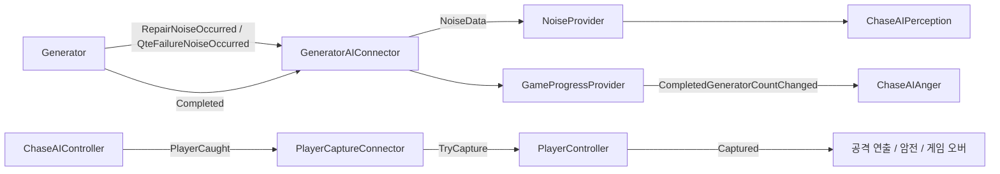

# AI–발전기–플레이어 연동 명세서

작성일: 2026-07-31  
대상 Unity 버전: `6000.3.20f1`

## 1. 문서 목적

이 문서는 서로 다른 담당자가 개발 중인 다음 세 영역을 하나의 게임 흐름으로 연결하기 위한 책임과 API를 정의한다.

- 발전기: `GeneratorFeature`, 커밋 `d82b663`
- 플레이어: `PlayerFeature`, 커밋 `5702129`
- AI: `modify-ai-chasesystem`, 커밋 `9a716ed`

AI의 `ATTACK`, 근접 포획 판정과 `PlayerCaught` 구현은 `9a716ed`에 포함되어 있으며 원격 `modify-ai-chasesystem`에도 반영되어 있다.

원격 `dev`의 `ba21430`에는 AI 커밋 `9a716ed`가 이미 병합되어 있다. 로컬 `dev`는 현재 `56e0208`로 뒤처져 있으므로 통합 브랜치를 오래된 로컬 `dev`에서 만들면 안 된다.

이 문서는 연동 방식만 정의한다. 발전기와 플레이어 담당 코드에 AI 판단을 직접 넣지 않는다.

## 2. 확인한 현재 상태

### 2.1 발전기 `d82b663`

발전기 쪽은 AI와 연결할 이벤트를 이미 제공한다.

| 이벤트 | 의미 | AI 연동 |
| --- | --- | --- |
| `RepairNoiseOccurred(Vector3)` | 수리 중 일정 간격으로 발생 | `GENERATOR` 소음으로 변환 |
| `QteFailureNoiseOccurred(Vector3)` | QTE 실패 시 발생 | `QTE_FAILURE` 소음으로 변환 |
| `Completed()` | 발전기 한 대의 수리 완료 | `GameProgressProvider.NotifyGeneratorCompleted()` 호출 |

발전기 시스템은 소음의 위치와 완료 사실만 알린다. AI 상태를 직접 변경하거나 `ChaseAIController`를 참조하지 않는다.

확인 명령:

```powershell
git show d82b663:Assets/02_Prototype/HG/Scripts/Generator/Generator.cs
```

### 2.2 플레이어 `5702129`

현재 플레이어 구현 상태는 다음과 같다.

- `MoveController`: 이동, 점프, 달리기, 앉기 처리
- `CharacterRotationController`: 카메라와 플레이어 회전 처리
- `PlayerController`: 비어 있음
- 포획, 조작 잠금, 사망, 게임 오버 연결 API 없음

따라서 현재 커밋 그대로는 AI의 `PlayerCaught` 이벤트를 안전하게 연결할 수 없다. 플레이어 담당자가 `PlayerController`에 하나의 포획 진입점을 제공해야 한다.

확인 명령:

```powershell
git show 5702129:Assets/02_Prototype/JW/Scripts/PlayerController.cs
git show 5702129:Assets/02_Prototype/JW/Scripts/MoveController.cs
git show 5702129:Assets/02_Prototype/JW/Scripts/CharacterRotationController.cs
```

### 2.3 현재 AI

AI가 외부에 제공하거나 사용하는 연동 지점은 다음과 같다.

| API | 방향 | 의미 |
| --- | --- | --- |
| `NoiseProvider.Emit(NoiseData)` | 외부 → AI | 소음 사실 전달 |
| `GameProgressProvider.NotifyGeneratorCompleted()` | 외부 → 게임 진행도 | 완료 수 1 증가 |
| `CompletedGeneratorCountChanged(int)` | 게임 진행도 → Chase AI | 발전기 완료 수에 따른 `Anger` 하한선 갱신 |
| `ChaseAIController.PlayerCaught` | AI → 외부 | 플레이어 포획 확정, 한 번만 발생 |

`PlayerCaught` 이후 AI는 `ATTACK` 상태에 머물며 이동, 소음 조사, Director Hint와 이탈 명령을 처리하지 않는다.

## 3. 책임 경계

연동은 다음 원칙을 지킨다.

1. 발전기는 소음과 완료 이벤트만 발행한다.
2. 플레이어는 `TryCapture()` 같은 자신의 상태 변경 API만 제공한다.
3. AI는 소음을 해석하고 포획 여부를 판단하지만 플레이어 컴포넌트를 직접 제어하지 않는다.
4. 별도의 `Integration` 계층이 이벤트를 변환하고 시스템을 연결한다.
5. `MasterAIProvider`는 AI 활동 주기 담당이며 게임 오버 매니저로 사용하지 않는다.
6. 발전기 또는 플레이어 코드에서 Chase AI의 FSM 상태를 직접 변경하지 않는다.



## 4. 발전기와 AI 연결

### 4.1 소음 연결

발전기 이벤트를 AI의 `NoiseData`로 변환한다.

| 발전기 이벤트 | `NOISE_TYPE` | 초기 상대 크기 |
| --- | --- | --- |
| `RepairNoiseOccurred` | `GENERATOR` | 큰 반경, 높은 강도 |
| `QteFailureNoiseOccurred` | `QTE_FAILURE` | 매우 큰 반경, 매우 높은 강도 |

정확한 반경과 강도는 코드에 고정하지 않는다. `NoiseEmitter` 또는 향후 난이도 설정 데이터에서 조정한다.

기존 `NoiseEmitter.EmitNoise()`는 자신의 `transform.position`만 사용한다. 발전기 이벤트가 전달한 위치를 그대로 쓰려면 다음 오버로드를 AI 쪽에 추가하는 방식을 권장한다.

```csharp
public void EmitNoise()
{
    EmitNoiseAt(transform.position);
}

public void EmitNoiseAt(Vector3 position)
{
    NoiseData noiseData = new NoiseData(
        position ,
        _radius ,
        _intensity ,
        _noiseType ,
        Time.time ,
        gameObject);

    bool wasEmitted = NoiseProvider.Emit(noiseData);

    if ( !wasEmitted )
    {
        return;
    }

    Debug.Log(
        $"[NoiseEmitter] {_noiseType} 소음 발생, " +
        $"반경: {_radius:F1}, 강도: {_intensity:F2}" ,
        this);
}
```

### 4.2 발전기 연동 컴포넌트

통합 후 `Assets/01_Main/02_Scripts/Integration/GeneratorAIConnector.cs`를 추가한다.

아래 코드는 합의용 기준 구현이다. 발전기 브랜치가 병합된 뒤 컴파일 검증해야 한다.

```csharp
using HideSeek.AI;
using HideSeek.Gameplay;
using HideSeek.Generators;
using UnityEngine;

namespace HideSeek.Integration
{
    [DisallowMultipleComponent]
    public sealed class GeneratorAIConnector : MonoBehaviour
    {
        [Header("References")]
        [SerializeField] private Generator _generator;
        [SerializeField] private GameProgressProvider _gameProgressProvider;

        [Header("Noise")]
        [SerializeField] private NoiseEmitter _repairNoiseEmitter;
        [SerializeField] private NoiseEmitter _qteFailureNoiseEmitter;

        private void OnEnable()
        {
            if ( _generator == null )
            {
                return;
            }

            _generator.RepairNoiseOccurred -= OnRepairNoiseOccurredActioned;
            _generator.RepairNoiseOccurred += OnRepairNoiseOccurredActioned;

            _generator.QteFailureNoiseOccurred -= OnQteFailureNoiseOccurredActioned;
            _generator.QteFailureNoiseOccurred += OnQteFailureNoiseOccurredActioned;

            _generator.Completed -= OnGeneratorCompletedActioned;
            _generator.Completed += OnGeneratorCompletedActioned;
        }

        private void OnDisable()
        {
            if ( _generator == null )
            {
                return;
            }

            _generator.RepairNoiseOccurred -= OnRepairNoiseOccurredActioned;
            _generator.QteFailureNoiseOccurred -= OnQteFailureNoiseOccurredActioned;
            _generator.Completed -= OnGeneratorCompletedActioned;
        }

        private void OnRepairNoiseOccurredActioned(Vector3 position)
        {
            _repairNoiseEmitter?.EmitNoiseAt(position);
        }

        private void OnQteFailureNoiseOccurredActioned(Vector3 position)
        {
            _qteFailureNoiseEmitter?.EmitNoiseAt(position);
        }

        private void OnGeneratorCompletedActioned()
        {
            if ( _gameProgressProvider == null )
            {
                Debug.LogError(
                    "[GeneratorAIConnector] GameProgressProvider가 없습니다." ,
                    this);

                return;
            }

            _gameProgressProvider.NotifyGeneratorCompleted();
        }
    }
}
```

### 4.3 발전기 오브젝트 설정

각 활성 발전기에 다음을 설정한다.

1. `GeneratorAIConnector`를 한 개만 추가한다.
2. 해당 발전기의 `Generator`를 연결한다.
3. 씬의 공용 `GameProgressProvider`를 연결한다.
4. `GENERATOR`로 설정한 `NoiseEmitter`를 연결한다.
5. `QTE_FAILURE`로 설정한 별도 `NoiseEmitter`를 연결한다.
6. 각 `NoiseEmitter`의 반경과 강도는 난이도 기준에 맞게 설정한다.

`QTE_FAILURE`는 `GENERATOR`보다 반경과 강도가 커야 한다. 완료 순간 소음은 기획에서 확정되지 않았으므로 추가하지 않는다.

### 4.4 발전기 완료 수 흐름

```text
Generator.Completed
→ GeneratorAIConnector
→ GameProgressProvider.NotifyGeneratorCompleted()
→ CompletedGeneratorCountChanged(completedCount)
→ ChaseAIController
→ ChaseAIAnger.SetCompletedGeneratorCount(completedCount)
→ Anger 하한선과 추격·수색 보정 갱신
```

`GameProgressProvider`가 완료 수의 단일 진실 공급원이다. `GeneratorQteProvider`는 UI와 QTE 등록 담당이므로 완료 수를 관리하지 않는다.

`RequiredGeneratorCount`는 후보 발전기 수가 아니라 실제 게임에서 활성화한 목표 발전기 수와 같아야 한다. 이 값은 씬 구성 또는 향후 발전기 배치 시스템이 한 번만 설정한다.

## 5. AI와 플레이어 포획 연결

### 5.1 플레이어 담당자가 제공해야 할 API

`PlayerController`가 이동, 회전, 상호작용 등 플레이어 하위 기능을 묶는 단일 진입점이 되어야 한다.

최소 요구 API:

```csharp
using System;
using UnityEngine;
using UnityEngine.InputSystem;

public sealed class PlayerController : MonoBehaviour
{
    [Header("References")]
    [SerializeField] private PlayerInput _playerInput;
    [SerializeField] private MoveController _moveController;
    [SerializeField] private CharacterRotationController _rotationController;

    private bool _isCaptured;

    public event Action Captured;

    public bool IsCaptured => _isCaptured;

    public bool TryCapture()
    {
        if ( _isCaptured )
        {
            return false;
        }

        _isCaptured = true;

        if ( _playerInput != null )
        {
            _playerInput.DeactivateInput();
        }

        if ( _moveController != null )
        {
            _moveController.enabled = false;
        }

        if ( _rotationController != null )
        {
            _rotationController.enabled = false;
        }

        Captured?.Invoke();

        return true;
    }
}
```

`PlayerInput`만 비활성화하면 `MoveController`에 저장된 `_moveDir`이 남아 이동이 계속될 수 있다. 따라서 포획 시 `MoveController`도 반드시 정지해야 한다.

향후 상호작용, 손전등, 아이템 사용 컴포넌트가 추가되면 `TryCapture()`에서 함께 비활성화한다. Animator는 공격·사망 연출에 필요하므로 비활성화하지 않는다.

### 5.2 포획 연결 컴포넌트

AI와 플레이어를 직접 결합하지 않고 `PlayerCaptureConnector`가 중개한다.

통합 후 권장 경로:

`Assets/01_Main/02_Scripts/Integration/PlayerCaptureConnector.cs`

```csharp
using HideSeek.AI;
using UnityEngine;

namespace HideSeek.Integration
{
    [DisallowMultipleComponent]
    public sealed class PlayerCaptureConnector : MonoBehaviour
    {
        [Header("References")]
        [SerializeField] private ChaseAIController _chaseAIController;
        [SerializeField] private PlayerController _playerController;

        private void OnEnable()
        {
            if ( _chaseAIController == null )
            {
                return;
            }

            _chaseAIController.PlayerCaught -= OnPlayerCaughtActioned;
            _chaseAIController.PlayerCaught += OnPlayerCaughtActioned;
        }

        private void OnDisable()
        {
            if ( _chaseAIController != null )
            {
                _chaseAIController.PlayerCaught -= OnPlayerCaughtActioned;
            }
        }

        private void OnPlayerCaughtActioned()
        {
            if ( _playerController == null )
            {
                Debug.LogError(
                    "[PlayerCaptureConnector] PlayerController가 없습니다." ,
                    this);

                return;
            }

            if ( !_playerController.TryCapture() )
            {
                return;
            }

            Debug.Log("[PlayerCaptureConnector] 플레이어 포획 처리를 시작합니다." , this);
        }
    }
}
```

### 5.3 게임 오버 흐름

초기 연결 흐름:

```text
ChaseAIController.PlayerCaught
→ PlayerCaptureConnector
→ PlayerController.TryCapture()
→ 이동·회전·상호작용 정지
→ PlayerController.Captured
→ 공격 연출
→ 화면 암전
→ 게임 오버 화면
```

공격 연출, 암전과 결과 화면은 Game Flow 또는 Cutscene 담당 시스템이 `PlayerController.Captured`를 구독해 처리한다.

AI는 다음을 담당하지 않는다.

- 플레이어 입력 컴포넌트 직접 제어
- Animator 파라미터 직접 변경
- 화면 암전
- 게임 오버 UI 열기
- 씬 재시작

체력, 피해량, 연속 공격과 공격 쿨다운은 만들지 않는다. 포획은 한 번 발생하면 게임 오버로 이어진다.

## 6. 담당자별 작업 목록

### 발전기 담당자

- `RepairNoiseOccurred`, `QteFailureNoiseOccurred`, `Completed` 이벤트의 의미와 발생 시점을 유지한다.
- AI 타입이나 `ChaseAIController`를 참조하지 않는다.
- 활성 발전기 수를 통합 담당자에게 전달한다.
- 이벤트 시그니처가 변경되면 통합 담당자에게 알린다.

### 플레이어 담당자

- 빈 `PlayerController`에 `TryCapture()`와 `Captured`를 구현한다.
- 포획 시 이동, 시점 회전, 상호작용과 아이템 입력을 확실히 정지한다.
- 공격·사망 Animator는 계속 실행 가능하게 유지한다.
- 플레이어 코드에서 `ChaseAIController`를 직접 참조하지 않는다.

### AI 담당자

- `NoiseProvider`, `GameProgressProvider`, `ChaseAIController.PlayerCaught` 계약을 유지한다.
- 발전기 소음을 다른 소음과 동일한 증거 우선순위 규칙으로 처리한다.
- 완료 수에 따라 `Anger` 하한선만 변경하고 `GlobalStress` 역할과 섞지 않는다.
- `PlayerCaught`를 한 번만 발행하고 `ATTACK` 상태를 유지한다.

### 통합 담당자

- `GeneratorAIConnector`와 `PlayerCaptureConnector`를 작성한다.
- 공용 통합 씬에서 모든 Inspector 참조를 연결한다.
- 실제 활성 발전기 수를 `GameProgressProvider`에 설정한다.
- 공격 연출, 암전, 게임 오버 시스템을 `PlayerController.Captured`에 연결한다.
- 이벤트 중복 구독과 발전기 완료 중복 집계를 검사한다.

## 7. 병합 순서

1. 원격 상태를 갱신하고 `origin/dev`에 `ba21430` 또는 그 이후 커밋이 있는지 확인한다.
2. 최신 `origin/dev`에서 별도의 통합 브랜치를 만든다.
3. `GeneratorFeature`의 `d82b663`을 병합한다.
4. `PlayerFeature`의 `5702129`를 병합한다.
5. 전체 C# 컴파일 오류를 먼저 해결한다.
6. `Integration` 연결 컴포넌트를 추가한다.
7. 별도의 공용 통합 씬에서 발전기, 플레이어와 AI를 배치한다.
8. Inspector 참조와 NoiseEmitter 설정을 저장한다.
9. 아래 테스트 순서대로 Play Mode 검증한다.

각 기능 브랜치의 프로토타입 씬을 서로 덮어쓰지 않는다. 최종 검증은 별도의 공용 통합 씬에서 수행한다.

세 브랜치의 공통 기준 커밋 `c1790ec` 이후 변경 파일을 비교했을 때 발전기, 플레이어와 최신 `origin/dev` 사이에 직접 겹치는 경로는 확인되지 않았다. 따라서 텍스트 충돌 가능성은 낮지만 Unity `.meta`, 패키지, 씬과 Prefab 참조는 병합 후 반드시 검증한다.

## 8. 통합 테스트 체크리스트

### 발전기 소음

- [ ] 수리 시작 후 설정된 간격마다 `GENERATOR` 소음이 발생한다.
- [ ] AI가 소음 반경 안에 있을 때만 소음을 수신한다.
- [ ] QTE 실패 시 `QTE_FAILURE` 소음이 한 번 발생한다.
- [ ] QTE 실패 소음의 반경과 강도가 일반 수리 소음보다 크다.
- [ ] 소음이 AI의 FSM 상태를 외부에서 직접 바꾸지 않는다.

### 발전기 완료와 Anger

- [ ] 발전기 한 대 완료 시 완료 수가 정확히 1 증가한다.
- [ ] 같은 발전기 완료가 두 번 집계되지 않는다.
- [ ] `CompletedGeneratorCountChanged` 로그와 Anger 갱신 로그가 이어서 발생한다.
- [ ] 완료 수에 맞는 Anger 하한선이 적용된다.
- [ ] Anger가 증가해도 Director의 휴식·이탈 주기는 유지된다.
- [ ] 모든 발전기 완료 시 `AllGeneratorsCompleted`가 한 번 발생한다.

### 플레이어 포획

- [ ] AI가 플레이어를 직접 발견하고 추격한 뒤 공격 범위에서 `ATTACK`으로 진입한다.
- [ ] `PlayerCaught`가 한 번만 발생한다.
- [ ] 플레이어 이동과 카메라 회전이 즉시 정지한다.
- [ ] 포획 후 입력을 다시 눌러도 움직이지 않는다.
- [ ] AI가 포획 후 움직이거나 이탈하지 않는다.
- [ ] 공격 연출 후 암전과 게임 오버 화면으로 이어진다.
- [ ] 벽을 사이에 둔 상태에서는 근접 포획되지 않는다.

### 수명주기

- [ ] Connector가 꺼졌다 켜져도 이벤트가 중복 구독되지 않는다.
- [ ] 씬 종료 중 정적 이벤트가 남지 않는다.
- [ ] 게임 재시작 시 발전기 완료 수와 플레이어 포획 상태가 초기화된다.

## 9. 현재 미완료 사항

- `GeneratorFeature`와 `PlayerFeature`는 최신 `origin/dev` 기반 통합 브랜치에 아직 병합되지 않았다.
- `PlayerFeature`에는 포획 API가 없다.
- 공격 연출, 암전, 게임 오버 UI 연결은 아직 없다.
- 발전기 및 QTE 실패 소음의 최종 반경·강도 값은 확정되지 않았다.
- 같은 씬에서 재시작할 경우를 위한 플레이어 포획 상태 복구 API는 아직 없다.

위 항목이 해결되기 전에는 각 시스템이 단독으로 동작하더라도 전체 게임 흐름이 완성된 것으로 판단하지 않는다.
