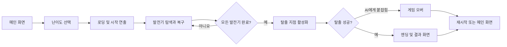
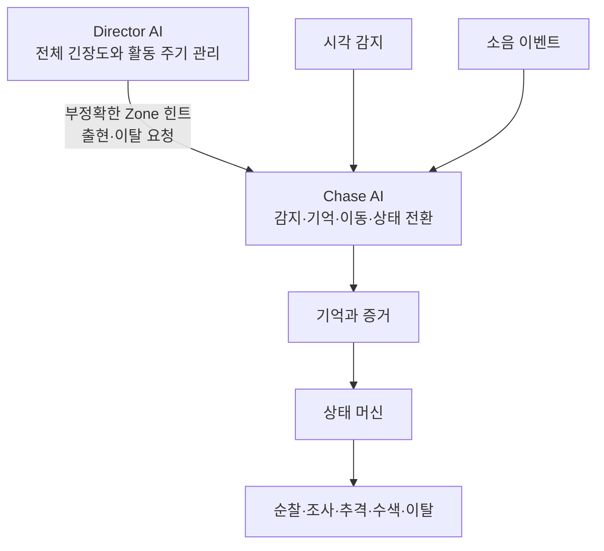

# PROJECT ISOLATION

> 1인칭 잠입 생존 공포 게임 기획서  
> 문서 버전: v0.2 (개발 초안)  
> 정리일: 2026-07-27  
> 프로젝트명은 가제이며, 최종 명칭은 추후 결정한다.

---

## 1. 게임 개요

플레이어는 전원이 차단된 폐쇄 시설을 탐색하며 발전기를 복구하고 탈출해야 한다. 시설 내부에는 플레이어의 시야 노출과 소음을 감지하는 단 하나의 추격 AI가 존재한다.

플레이어는 추격 AI와 싸울 수 없다. 이동 소음을 조절하고, 책상 아래에 숨거나 디코이로 잘못된 정보를 만들어 AI의 수색을 피해야 한다. 발전기 수리는 반드시 소음과 시야 제한을 동반하므로, 목표 수행 자체가 위험을 발생시킨다.

### 1.1 기본 정보

| 항목 | 내용 |
| --- | --- |
| 장르 | 1인칭 생존 공포, 잠입, 추격, 미션 수행 |
| 플레이 방식 | 싱글 플레이 |
| 목표 플레이 시간 | 1회 약 10~15분 |
| 핵심 위협 | 시각·청각 정보로 플레이어를 추적하는 Chase AI 1개체 |
| 핵심 목표 | 활성 발전기 복구 후 탈출 지점 도달 |
| 전투 | 없음 |
| 실패 방식 | Chase AI에게 붙잡히면 즉시 게임 오버 |
| 반복 요소 | 발전기 위치, AI 활동 주기, 수색 흐름, 난이도 설정 |

### 1.2 한 문장 콘셉트

> 제한된 정보 속에서 스스로 소음을 만들며 목표를 수행하고, 그 결과를 추적하는 AI로부터 살아남는 짧은 잠입 공포 게임.

### 1.3 핵심 차별점

- **목표 수행과 생존의 충돌:** 안전하게 숨어 있기만 해서는 게임을 끝낼 수 없다.
- **근거를 사용하는 추격 AI:** AI는 플레이어의 현재 위치를 항상 알지 못하며, 직접 본 장면과 들은 소음을 근거로 행동한다.
- **긴장도의 완급 조절:** Director AI가 Chase AI의 출현과 이탈을 조절해 압박과 휴식 구간을 만든다.
- **짧지만 달라지는 플레이:** 고정 후보 중 발전기 위치를 무작위로 선택해 매 플레이의 이동 동선을 바꾼다.

---

## 2. 개발 목표와 범위

### 2.1 프로젝트 목표

본 프로젝트의 목표는 대규모 공포 게임을 완성하는 것이 아니라, 짧은 플레이 안에서 다음 설계와 구현 역량을 검증하는 것이다.

- Director AI와 개체 AI를 분리한 계층형 AI 구조
- 시각·청각 기반 감지 시스템
- 마지막 목격 위치와 마지막 소음 위치를 사용하는 기억 시스템
- 상태 머신 기반 순찰·조사·추격·수색·이탈 행동
- NavMesh 기반 이동과 Zone 기반 탐색 범위 제어
- 이벤트 기반 소음 전달 구조
- 무작위 발전기 배치를 활용한 반복 플레이
- 발전기 QTE와 실패 페널티
- 상황에 따라 전환되는 다이내믹 음악
- 3인 협업과 Git 기반 개발

### 2.2 MVP 범위

| 항목 | MVP 기준 |
| --- | --- |
| 맵 | 5~7개 Zone으로 구성된 단일 시설 |
| Chase AI | 1개체 |
| 발전기 | 후보 지점 5개 이상, 실제 활성 수량은 3개를 초기안으로 사용 |
| 은신처 | 책상 아래 1종 |
| 디코이 | 1종 |
| 난이도 | Easy / Normal / Hard |
| 성공 엔딩 | 탈출 성공 1종 |
| 실패 | Chase AI에게 붙잡히면 즉사 |
| 컷신 | 시작, 사망, 엔딩 각 1종의 짧은 인게임 연출 |

---

## 3. 디자인 원칙

### 3.1 제한된 정보로 만드는 공포

플레이어는 Chase AI의 정확한 위치를 항상 알 수 없다. 다음 간접 정보를 조합해 위치와 상태를 추측해야 한다.

- 발소리와 울음소리
- 문과 Vent에서 발생하는 소리
- 환풍구 내부의 움직임
- 음악 상태 변화

정보는 부족해야 하지만 무작위여서는 안 된다. 플레이어가 주의를 기울이면 위험을 예측할 수 있어야 한다.

### 3.2 위험을 발생시키는 목표

발전기 수리는 다음 제약을 통해 플레이어를 위험에 노출한다.

- 일정 시간 한 위치에 머물러야 한다.
- 발전기 작동음과 QTE 실패음이 발생한다.
- 작업 중 이동이 제한된다.
- QTE UI 때문에 주변을 확인하기 어렵다.
- AI 접근 소리를 들으면 작업을 중단하고 도망칠 수 있다.

### 3.3 공정한 추격

Chase AI는 다음 정보만으로 플레이어를 추적한다.

1. 현재 직접 확인한 시야 정보
2. 현재 직접 감지한 소음
3. 마지막 목격 위치
4. 마지막 소음 위치
5. Director AI가 제공한 부정확한 Zone 힌트

AI가 플레이어를 보지 못한 상황에서 숨은 책상을 바로 확인하거나, 시야를 잃은 뒤에도 현재 좌표를 계속 추적해서는 안 된다. 플레이어는 발견 원인을 자신의 행동에서 이해할 수 있어야 한다.

### 3.4 긴장과 회복의 반복

Chase AI는 계속 플레이어를 압박하지 않는다. Director AI는 최근 압박 수준을 나타내는 `GlobalStress`를 바탕으로 활동 구간과 휴식 구간을 교차시킨다.

---

## 4. 게임 진행 구조

### 4.1 전체 흐름



### 4.2 핵심 플레이 루프

1. 발전기 후보 위치를 탐색한다.
2. 이동 과정에서 발생하는 소음과 시야 노출을 관리한다.
3. AI가 접근하면 숨거나 디코이를 사용해 조사 위치를 바꾼다.
4. 안전하다고 판단한 순간 발전기 수리를 시작한다.
5. QTE를 수행하며 AI 접근 소리를 확인한다.
6. 실패 또는 발전기 작동으로 큰 소음이 발생하면 작업을 포기하고 도주할지 판단한다.
7. 모든 발전기를 복구할 때까지 반복한다.
8. 활성화된 탈출 지점에 도달한다.

### 4.3 승리 조건

- 이번 플레이에서 활성화된 모든 발전기를 복구한다.
- 최종 탈출 장치를 활성화한다.
- 탈출 지점에 도달한다.

### 4.4 패배 조건

- Chase AI의 공격 판정에 적중한다.
- 별도의 체력 판정 없이 즉시 사망 연출과 게임 오버로 전환한다.

---

## 5. 플레이어 시스템

### 5.1 시점과 카메라

- 1인칭 시점을 사용한다.
- 마우스로 카메라를 회전한다.
- 좌우 회전은 제한하지 않고 상하 회전 각도만 제한한다.
- 기본 카메라 흔들림은 최소화한다.
- 멀미 방지를 위해 카메라 흔들림을 설정에서 끌 수 있어야 한다.

### 5.2 기본 행동

- 걷기
- 달리기
- 앉아서 이동
- 책상 아래 진입 및 은신
- 오브젝트 상호작용
- 디코이 조준 및 투척

### 5.3 이동과 소음

| 행동 | 속도 | 소음 | 주요 판단 |
| --- | --- | --- | --- |
| 앉아서 이동 | 느림 | 매우 낮음 | 안전하지만 도주에 불리함 |
| 걷기 | 보통 | 낮음 | 기본 탐색 수단 |
| 달리기 | 빠름 | 높음 | 빠른 이탈이 가능하지만 쉽게 감지됨 |
| 책상 아래 은신 | 이동 불가 | 없음 | 안전하지만 진입 후 시점 회전 외의 행동이 제한됨 |

수치 자체는 난이도별 설정 데이터로 관리하며, 위 표는 상대적인 기준만 정의한다.

### 5.4 앉기

앉기 상태에서는 다음 요소가 변경된다.

- 플레이어와 카메라 높이 감소
- 이동 속도 감소
- 발소리 반경 감소
- 낮은 장애물 통과 가능
- 책상 아래 진입 가능

### 5.5 책상 아래 은신

책상 아래는 별도의 상호작용 지점으로 구성한다.

**진입**

- 지정된 진입 위치에서 상호작용한다.
- 플레이어 위치를 진입 기준점으로 보정한다.
- 은신 전용 상태로 전환한다.
- 은신처에 들어간 뒤에는 이동할 수 없다.

**은신 중 행동**

- 이동 입력을 사용할 수 없다.
- 시점을 회전할 수 있다.
- 달리기와 발전기 상호작용은 사용할 수 없다.
- 디코이 사용 가능 여부는 플레이 테스트 후 확정한다.

**발각 조건**

- AI가 플레이어의 진입 장면을 직접 목격했다.
- 은신 중 큰 소음이 발생했다.
- 높은 수색 확신을 가진 AI가 해당 책상을 조사했다.
- 플레이어 신체가 은신 범위 밖으로 노출됐다.

### 5.6 디코이

디코이는 AI를 확정적으로 속이는 아이템이 아니라, AI가 조사할 새로운 증거를 만드는 도구다.

```text
조준 → 투척 → 표면 충돌 → 소음 이벤트 발생 → AI 감지 → 해당 위치 조사
```

초기안은 다음과 같다.

- 최대 소지량 2개
- 맵 내 추가 획득은 없거나 매우 적게 배치
- 연속 사용 제한
- 충돌 위치 또는 표면에 따라 소음 반경 조정 가능

### 5.7 상호작용

Raycast 기반 상호작용을 사용한다.

- 발전기 수리
- 문 조작
- 책상 아래 진입
- 디코이 획득
- 탈출 장치 작동

화면 중앙에는 현재 가능한 행동만 간결하게 표시한다.

```text
[E] 발전기 수리
[E] 책상 아래 숨기
[E] 탈출 장치 작동
```

---

## 6. 소음과 증거 시스템

### 6.1 소음 데이터

모든 소음 이벤트는 다음 정보를 가진다.

- 발생 위치
- 감지 반경
- 강도
- 종류
- 발생 시간
- 발생 주체

소음 종류의 초기 분류는 다음과 같다.

- `FOOTSTEP`
- `RUN`
- `DECOY`
- `GENERATOR`
- `QTE_FAILURE`
- `DOOR`
- `ENVIRONMENT`

### 6.2 상대적 우선도

| 소음 | 감지 범위 | 조사 우선도 |
| --- | --- | --- |
| 앉아서 이동 | 매우 작음 | 낮음 |
| 걷기 | 작음 | 낮음 |
| 달리기 | 중간 | 중간 |
| 문 조작 | 중간 | 중간 |
| 디코이 | 큼 | 높음 |
| 발전기 작동 | 큼 | 높음 |
| QTE 실패 | 매우 큼 | 매우 높음 |

정확한 반경과 가중치는 난이도 설정 데이터로 관리한다.

### 6.3 처리 원칙

- 소음을 발생시킨 오브젝트가 이벤트를 발행한다.
- 감지 가능한 범위의 AI만 이벤트를 수신한다.
- AI가 매 프레임 모든 소음 오브젝트를 검색하지 않는다.
- 새로운 증거의 강도와 최신성을 비교해 현재 조사 대상을 결정한다.
- 환경 소리는 공포 연출에 사용할 수 있지만, AI가 감지하는 게임플레이 소음과 명확히 구분한다.

---

## 7. 발전기와 QTE

### 7.1 발전기 배치

발전기는 런타임에 임의 좌표로 생성하지 않는다. 맵에 미리 배치한 후보 지점 중 유효한 위치를 선택한다.

초기 선택 규칙은 다음과 같다.

- 후보 지점은 최소 5개 이상 준비한다.
- 한 게임에서 3개를 활성화하는 안을 우선 검증한다.
- 같은 Zone에 여러 발전기가 몰리지 않도록 제한한다.
- 시작 지점과 지나치게 가까운 후보는 제외한다.
- 탈출 지점과 인접한 후보의 수를 제한한다.

```text
후보 목록 수집
→ 유효하지 않은 후보 제외
→ Zone 중복을 피하며 후보 선택
→ 선택된 발전기만 활성화
```

### 7.2 발전기 상태

- `INACTIVE`: 상호작용 전 또는 작업 중단 상태
- `INTERACTING`: 플레이어가 수리 중인 상태
- `COMPLETED`: 수리가 끝난 상태

### 7.3 수리 진행

1. 플레이어가 발전기와 상호작용한다.
2. 상호작용을 유지하는 동안 수리 진행도가 상승한다.
3. 무작위 간격으로 타이밍 QTE가 발생한다.
4. 성공 구간에서 입력하면 수리를 계속한다.
5. 실패하면 수리가 잠시 중단되고 큰 소음이 발생한다.
6. 플레이어는 언제든 취소 입력으로 작업을 포기할 수 있다.

### 7.4 QTE 규칙

- 원형 또는 수평 게이지와 이동 인디케이터를 사용한다.
- 성공 구간과 지정 입력 키를 명확히 표시한다.
- 한 발전기에서 최소 발생 횟수를 보장한다.
- 발생 간격은 무작위로 정하되 연속 발생의 최소 간격을 둔다.
- 실패 시 붉은 피드백, 스파크, 큰 소음을 제공한다.
- 실패 시 진행도 감소 여부와 감소량은 난이도 설계 후 확정한다.

### 7.5 완료 피드백

- 발전기와 주변 조명 점등
- 기계 작동음 시작
- 완료 UI 표시
- 남은 발전기 수 갱신
- 일부 환경 조명 정상화
- 완료 시 큰 소음을 발생시킬지는 플레이 테스트 후 확정

---

## 8. AI 구조

### 8.1 계층 구조



### 8.2 공통 원칙

- Director AI는 플레이어의 정확한 좌표를 전달하지 않는다.
- Chase AI는 직접 감지한 정보를 Director 힌트보다 우선한다.
- Chase AI는 플레이어를 놓칠 수 있고, 수색에 실패하면 포기할 수 있다.
- 근거 없이 은신처를 확인하지 않는다.
- AI의 판단에 사용된 증거를 디버그 화면에서 확인할 수 있어야 한다.

---

## 9. Director AI

### 9.1 역할

Director AI는 직접 이동하거나 추격하지 않는다.

- Chase AI의 출현과 이탈 제어
- 전체 긴장도인 `GlobalStress` 관리
- 조사할 대략적인 Zone 선택
- 부정확한 조사 힌트 제공
- 플레이어에게 휴식 구간 제공

### 9.2 상태

| 상태 | 동작 |
| --- | --- |
| `DORMANT` | Chase AI가 맵 외부 또는 Vent에서 대기하고, `GlobalStress`가 감소한다. |
| `ACTIVE` | Chase AI가 맵에서 활동하고, 거리와 추격 상황에 따라 `GlobalStress`가 증가한다. |

### 9.3 GlobalStress

`GlobalStress`는 플레이어가 최근에 받은 압박의 누적값이다.

**증가 조건**

- Chase AI가 플레이어를 추격 중이다.
- 플레이어와 AI의 거리가 가깝다.
- 플레이어가 짧은 시간 안에 반복해서 발각된다.
- 플레이어가 좁은 공간에서 압박받고 있다.

**감소 조건**

- Director AI가 `DORMANT` 상태다.
- 플레이어가 일정 시간 발견되지 않았다.
- 플레이어와 AI의 거리가 충분히 멀다.

**활용 흐름**

```text
Stress 낮음 → Chase AI 출현 가능
Stress 중간 → 현재 압박 유지
Stress 상한 도달 → Chase AI 이탈 유도
Stress 감소 → 다음 출현 가능
```

### 9.4 Director 힌트

힌트는 정답이 아니라 Chase AI가 수색을 시작할 수 있는 대략적인 정보다.

**포함 정보**

- 목표 Zone ID
- Zone 내부의 기준 위치
- 수색 반경
- 긴급도
- 유효 시간

**포함하면 안 되는 정보**

- 플레이어의 현재 좌표
- 플레이어가 숨은 정확한 은신처
- 플레이어의 실시간 이동 방향
- 매 프레임 갱신되는 추적 위치

---

## 10. Chase AI

### 10.1 정보 우선순위

```text
현재 직접 시야
> 현재 직접 들은 소음
> 최근 마지막 목격 위치
> 최근 마지막 소음 위치
> Director 힌트
> 기본 순찰 위치
```

최신 정보라고 해서 무조건 높은 우선순위를 갖지는 않는다. 직접 감지 여부, 증거 강도, 경과 시간을 함께 비교한다.

### 10.2 상태 머신

| 상태 | 핵심 행동 | 주요 전환 |
| --- | --- | --- |
| `DORMANT` | 맵 외부 또는 Vent에서 대기 | Director의 출현 요청 → `PATROL` |
| `PATROL` | 현재 또는 지정 Zone 순찰 | 소음 → `INVESTIGATE`, 시야 확보 → `CHASE`, 이탈 요청 → `RETREAT` |
| `INVESTIGATE` | 소음 또는 힌트 위치 조사 | 시야 확보 → `CHASE`, 증거 없음 → `SEARCH` |
| `CHASE` | 직접 확인한 플레이어 추격 | 시야 상실 → 마지막 목격 위치를 기준으로 `SEARCH` |
| `SEARCH` | 마지막 증거 주변의 제한된 지점 수색 | 새 소음 → `INVESTIGATE`, 시야 확보 → `CHASE`, 실패 → `PATROL` |
| `RETREAT` | 가까운 Vent 또는 이탈 지점으로 이동 | 도착 → `DORMANT` |

추격 중에는 Director 힌트를 무시하고 직접 확인한 플레이어 정보를 우선한다.

### 10.3 시야 감지

플레이어가 다음 조건을 모두 만족할 때 시야 증거를 누적한다.

- 감지 거리 이내에 있다.
- 시야각 안에 있다.
- AI와 플레이어 사이에 장애물이 없다.
- 설정된 인지 시간 이상 노출된다.

한 프레임의 노출만으로 즉시 추격하지 않는다. 거리, 조명 또는 자세를 인지 속도에 반영할지는 MVP 이후 결정한다.

### 10.4 기억과 증거

Chase AI는 다음 데이터를 저장한다.

- 마지막 목격 위치와 시간
- 마지막 소음 위치와 시간
- 현재 증거 종류
- 증거 신뢰도
- 현재 수색 횟수

시야를 잃은 이후에는 마지막 목격 위치까지만 이동하며, 플레이어의 현재 좌표를 계속 갱신하지 않는다.

### 10.5 수색

수색 후보는 맵에 미리 배치한 포인트와 NavMesh 위의 유효 지점을 함께 사용할 수 있다.

초기 우선순위는 다음과 같다.

1. 마지막 목격 위치
2. 마지막으로 확인한 이동 방향
3. 가까운 수색 포인트
4. 근거가 있는 인접 은신처
5. 주변의 무작위 NavMesh 지점

MVP에서는 한 번의 수색에서 방문하는 지점을 최대 3개로 제한한다.

### 10.6 은신처 조사 원칙

- AI가 플레이어의 진입을 목격했으면 해당 은신처의 조사 우선도를 크게 높인다.
- 은신처 근처에서 강한 소음을 들었으면 조사 후보에 포함한다.
- 증거가 부족하면 모든 책상을 순서대로 확인하지 않는다.
- 조사 애니메이션과 공격 판정은 플레이어가 결과를 이해할 수 있도록 구분한다.

### 10.7 공격

```text
공격 거리 진입
→ 짧은 공격 연출
→ 플레이어 조작 중지
→ 화면 암전
→ 게임 오버 화면
```

복잡한 전투는 구현하지 않으며, 사망 연출은 2~4초 수준으로 제한한다.

### 10.8 이탈

- 가까운 Vent 또는 지정 이탈 지점으로 이동한다.
- 가능하면 플레이어가 직접 보고 있는 Vent는 피한다.
- 도착하면 비활성화하고 `DORMANT` 상태로 전환한다.
- Vent 내부 이동은 구현하지 않고 연출과 위치 전환을 조합한다.

---

## 11. 맵과 Zone

### 11.1 맵 구조

맵은 5~7개의 Zone으로 나눈다. 초기 예시는 다음과 같다.

- 시작 구역
- 발전실
- 연구실
- 창고
- 사무실
- 정비 구역
- 탈출 구역

### 11.2 Zone 데이터

각 Zone은 다음 정보를 관리한다.

- Zone ID와 이름
- 인접 Zone 목록
- 순찰 포인트
- 수색 포인트
- 발전기 후보 지점
- 책상 은신처
- Vent와 진입 지점
- 환경 조명

### 11.3 수색 포인트 배치

수색 포인트는 AI가 의미 없이 무작위로 걷는 모습을 줄이기 위해 사용한다.

- 방 입구
- 복도 교차점
- 발전기 주변
- 책상 주변
- 시야가 트인 공간
- 플레이어의 주요 이동 동선

한 공간에 지나치게 많은 포인트를 배치하지 않으며, 이동 결과가 반복적으로 보이지 않는 최소 수만 둔다.

### 11.4 Vent

Vent는 Chase AI의 출현과 이탈을 표현한다.

- Zone마다 최소 1개 배치를 권장한다.
- 출현·이탈 연출과 접근 사운드를 재생한다.
- 맵 반대편 Vent로의 이동은 필요할 때만 위치 전환으로 처리한다.

### 11.5 환경 연출

**조명**

- 어두운 시설과 붉은 비상등
- 사이렌과 동기화된 점멸
- 발전기 복구 후 일부 조명 정상화
- AI 접근 시 제한적인 깜빡임

**환경 사운드**

- 기계 작동음과 환풍기
- 전기 스파크와 금속 충격
- 먼 거리의 사이렌
- 문 작동음
- Vent 내부의 움직임

환경음은 실제 AI 소리와 유사한 질감을 사용해 긴장감을 만들되, 학습 가능한 차이는 남겨야 한다.

---

## 12. 난이도

난이도는 게임 시작 전에 선택한다. 초기 버전에서는 조정 항목을 제한해 밸런싱 범위가 지나치게 커지지 않도록 한다.

| 요소 | Easy | Normal | Hard |
| --- | --- | --- | --- |
| AI 출현 간격 | 긴 편 | 보통 | 짧은 편 |
| `GlobalStress` 감소 속도 | 빠름 | 보통 | 느림 |
| 증거 신뢰도 감소 속도 | 빠름 | 보통 | 느림 |
| AI 이탈 기준 | 낮음 | 보통 | 높음 |
| QTE 성공 판정 범위 | 넓음 | 보통 | 좁음 |

초기에는 AI 이동 속도, 시야 거리, 수색 횟수까지 동시에 변경하지 않는다. 난이도 차이는 플레이 테스트로 체감이 부족할 때 한 항목씩 추가한다.

---

## 13. UI와 사용자 경험

### 13.1 화면 구성

**메인 화면**

- 게임 시작
- 설정
- 종료

**난이도 선택**

- Easy / Normal / Hard
- 각 난이도의 짧은 설명
- 선택 후 로딩 화면으로 전환

**인게임 HUD**

- 화면 중앙 상호작용 안내
- 남은 발전기 수
- 디코이 보유량
- QTE UI
- 일시 정지 메뉴

체력바, 미니맵, AI 위치 표시는 사용하지 않는다.

**결과 화면**

- 탈출 성공 또는 게임 오버 메시지
- 플레이 시간
- 완료한 발전기 수
- 재시작
- 메인 화면으로 이동

### 13.2 설정

| 분류 | 항목 |
| --- | --- |
| 그래픽 | 해상도, 전체 화면, 품질, 수직 동기화, 밝기 |
| 사운드 | 전체 볼륨, 배경 음악, 효과음 |
| 조작 | 마우스 감도, 카메라 흔들림, 선택적 키 설정 |

밝기 설정은 공포 분위기를 훼손할 정도로 화면을 밝게 만들지 않되, 최소한의 시인성과 접근성을 보장해야 한다.

---

## 14. 음악, 사운드, 컷신

### 14.1 다이내믹 음악 상태

| 상태 | 조건과 연출 |
| --- | --- |
| `AMBIENT` | AI가 멀리 있고 긴장도가 낮은 기본 상태 |
| `TENSION` | AI가 같은 Zone 또는 인접 Zone에 있거나 소음을 조사 중인 상태 |
| `CHASE` | AI가 플레이어를 직접 발견한 상태 |
| `SAFE` | AI가 추격을 포기했거나 Director가 `DORMANT`로 전환한 상태 |
| `ENDING` | 모든 발전기가 완료되고 탈출 장치가 활성화된 상태 |

음악은 즉시 교체하지 않고 레이어 또는 페이드 방식으로 전환한다. 추격 종료 직후 바로 평온해지지 않고 `TENSION`을 거쳐 `AMBIENT`로 복귀한다.

### 14.2 필수 효과음

**플레이어**

- 걷기, 달리기, 앉아서 이동
- 디코이 투척
- 상호작용

**Chase AI**

- 발소리와 울음소리
- 수색과 공격
- Vent 출입

**발전기**

- 비활성 기계음과 수리음
- QTE 성공·실패
- 완료음과 전기 스파크

**환경**

- 사이렌, 전기음, 환풍기
- 금속 충격, 문, 조명 점멸

### 14.3 컷신

| 컷신 | 주요 내용 | 길이 원칙 |
| --- | --- | --- |
| 시작 | 시설 전원 차단, 비상등, 목표 제시, 멀리서 들리는 AI 소리 | 조작 시작을 늦추지 않도록 짧게 구성 |
| 사망 | AI 포획, 조작 중지, 짧은 공격, 암전 | 약 2~4초 |
| 엔딩 | 탈출 장치 작동, 문 개방, 탈출, AI 접근, 문 폐쇄 | 결과 화면으로 빠르게 연결 |

---

## 15. 팀 역할

### 15.1 현민

- Director AI
- Chase AI
- 시각·청각 감지와 기억 시스템
- AI 상태 머신과 수색 시스템
- Zone 및 Vent 연동
- UI 시스템 구조와 데이터 연결
- 메인 화면, 난이도 선택, 설정 저장, HUD, 결과 흐름
- 맵 배치

### 15.2 형곤

- 시작·사망·엔딩 컷신
- 발전기 진행도와 QTE
- 다이내믹 음악
- UI 시각 연출
- QTE UI, 화면 전환, 버튼 애니메이션, 페이드, 결과 연출

### 15.3 진우

- 1인칭 플레이어
- 걷기, 달리기, 앉기
- 책상 아래 진입
- Raycast 상호작용
- 디코이 투척
- 플레이어 소음 발생
- 맵 배치

### 15.4 공통 작업

- 맵 Graybox와 환경 배치
- 기능 통합 및 플레이 테스트
- 버그 재현과 수정 확인
- 사운드 및 효과음 탐색
- 외부 에셋 라이선스 정리
- 난이도 밸런스 조정
- 포트폴리오 영상 촬영

UI는 현민이 상태와 데이터 흐름을, 형곤이 시각 표현과 연출을 담당한다. 두 영역의 인터페이스는 구현 전에 합의한다.

---

## 16. 데이터와 협업 원칙

### 16.1 데이터 분리

다음 값은 코드에 직접 고정하지 않고 설정 데이터로 관리한다.

- 이동 속도와 소음 반경
- AI 시야 거리, 시야각, 인지 시간
- 증거 신뢰도와 감소 속도
- `GlobalStress` 증가·감소량
- AI 출현·이탈 기준
- QTE 간격과 성공 범위
- 발전기 수리 시간과 실패 페널티
- 난이도별 보정값

### 16.2 시스템 간 경계

- 플레이어는 소음 이벤트를 발행하지만 AI 상태를 직접 변경하지 않는다.
- 소음 시스템은 감지 정보를 전달하지만 AI의 최종 행동을 결정하지 않는다.
- Director AI는 힌트와 활동 요청만 전달한다.
- Chase AI가 자신의 감각, 기억, 상태에 따라 최종 행동을 선택한다.
- UI는 게임 상태를 표시하며 핵심 게임 로직을 소유하지 않는다.

### 16.3 외부 에셋 관리

모든 외부 사운드, 모델, 애니메이션, 효과에는 다음 정보를 기록한다.

- 에셋 이름
- 출처 URL 또는 배포처
- 라이선스
- 상업적 사용 가능 여부
- 수정 여부
- 프로젝트 내 사용 위치

출처나 라이선스가 불명확한 에셋은 프로젝트에 포함하지 않는다.

---

## 17. 권장 구현 순서

1. **Graybox와 플레이어 이동:** Zone을 구분한 테스트 맵, 걷기·달리기·앉기, 상호작용을 완성한다.
2. **소음 수직 슬라이스:** 플레이어 행동이 소음 이벤트를 만들고 디버그 화면에서 범위를 확인한다.
3. **Chase AI 기본 루프:** `PATROL → INVESTIGATE → CHASE → SEARCH` 흐름을 구현한다.
4. **기억과 공정성 검증:** 마지막 목격·소음 위치만으로 플레이어를 놓치고 다시 찾는지 확인한다.
5. **발전기와 QTE:** 무작위 배치, 수리, 실패 소음, 완료 조건을 연결한다.
6. **은신처와 디코이:** AI의 증거 판단과 함께 통합한다.
7. **Director AI:** `GlobalStress`, 출현·이탈, Zone 힌트를 연결한다.
8. **전체 게임 흐름:** 난이도 선택, 승리·패배, 결과 화면을 완성한다.
9. **연출과 사운드:** 컷신, 다이내믹 음악, 환경 효과를 추가한다.
10. **밸런스와 안정화:** 10~15분 플레이 기준으로 반복 테스트한다.

---

## 18. MVP 완료 기준

다음 조건을 모두 만족하면 핵심 MVP가 완성된 것으로 본다.

- [ ] 플레이어가 걷기, 달리기, 앉기, 상호작용을 문제없이 사용할 수 있다.
- [ ] 이동, 문, 디코이, 발전기, QTE 실패가 서로 다른 소음 이벤트를 발생시킨다.
- [ ] Chase AI가 시야와 소음을 구분해 반응한다.
- [ ] AI가 시야를 잃은 뒤 플레이어의 현재 좌표를 추적하지 않는다.
- [ ] AI가 마지막 증거 주변을 수색하고 실패하면 추격을 포기한다.
- [ ] 근거가 없는 상태에서 플레이어의 은신처를 바로 조사하지 않는다.
- [ ] Director AI가 압박 구간과 휴식 구간을 만든다.
- [ ] 발전기 후보 중 일부만 무작위로 활성화된다.
- [ ] 발전기 QTE 성공·실패와 소음 페널티가 작동한다.
- [ ] 모든 발전기 완료 후 탈출 지점이 활성화된다.
- [ ] 사망과 탈출이 각각 결과 화면으로 연결된다.
- [ ] 한 번의 플레이가 약 10~15분 안에 끝난다.
- [ ] Easy / Normal / Hard의 차이를 플레이어가 체감할 수 있다.
- [ ] 게임 진행을 막는 치명적 버그 없이 처음부터 끝까지 플레이할 수 있다.

---

## 19. 미정 사항

다음 항목은 확정된 요구사항이 아니다. 프로토타입과 플레이 테스트 결과를 근거로 결정한다.

| 항목 | 현재 초기안 | 결정 기준 |
| --- | --- | --- |
| 최종 프로젝트명 | PROJECT ISOLATION | 프로젝트 정체성과 검색 중복 검토 |
| 활성 발전기 수 | 3개 | 목표 플레이 시간과 이동 거리 |
| 디코이 최대 소지량 | 2개 | AI 회피가 지나치게 쉬워지는지 확인 |
| 은신 중 디코이 사용 | 제한 또는 불가 | 은신처의 안정성과 탈출 선택지 균형 |
| QTE 실패 시 진행도 감소 | 적용 검토 | 실패 페널티가 좌절보다 긴장을 만드는지 확인 |
| 발전기 완료 소음 | 적용 검토 | 완료 직후 추격이 반복적으로 강제되는지 확인 |
| 시야 인지 보정 요소 | 거리·조명·자세 반영 검토 | 구현 비용 대비 플레이어가 차이를 이해할 수 있는지 확인 |
| 키 설정 | 선택 기능 | MVP 일정과 접근성 우선순위 |

미정 사항은 담당자가 임의로 확정하지 않고, 테스트 결과와 팀 합의를 문서에 반영한 뒤 구현한다.
