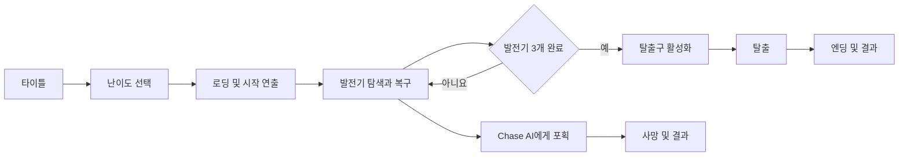
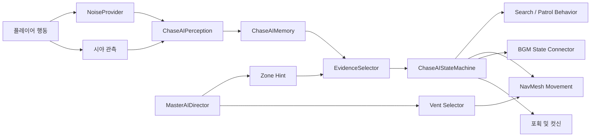

# PROJECT ISOLATION 기술 개요

이 문서는 PROJECT ISOLATION의 게임 시스템과 코드 구조를 소개합니다. 프로젝트의 핵심 목표는 플레이어의 현재 좌표를 알고 움직이는 추격자가 아니라, 시각·청각 증거를 수집하고 제한된 정보로 판단하는 공포 게임 AI를 만드는 것입니다.

[README로 돌아가기](./README.md) · [WebGL로 플레이](https://iibluell.github.io/Project_Hide-Seek/)

## 1. 전체 게임 흐름



런타임의 중심은 `GameProgressProvider`입니다. 발전기 완료 수를 집계하고 모든 목표가 끝났을 때 탈출 시스템, 목표 표시, BGM에 이벤트를 전달합니다. 각 시스템은 서로를 매 프레임 검색해 상태를 복제하지 않고 필요한 이벤트를 구독해 반응합니다.

## 2. AI 아키텍처

AI는 전체 긴장도를 조절하는 Master AI와 실제 감지·판단·이동을 담당하는 Chase AI로 나뉩니다.



### 2.1 Master AI

`MasterAIProvider`는 Director, Zone, Vent와 Chase AI 사이의 연결 지점입니다. `MasterAIDirector`는 최근 압박 정도를 나타내는 `GlobalStress`를 갱신하며 다음 흐름을 관리합니다.

- Chase AI의 활동 시작과 이탈 요청
- 휴식 구간 이후 재등장
- 플레이어가 있는 정확한 위치 대신 Zone 단위로 생성하는 간접 힌트
- 플레이어 Zone과 인접 Zone을 피하는 Vent 후보 선택

Director는 Chase AI의 상태를 직접 지정하지 않습니다. 활동·이탈·힌트를 요청하고, Chase AI가 자신의 감각과 기억을 바탕으로 최종 행동을 결정합니다.

### 2.2 Chase AI

Chase AI는 다음 책임을 분리해 구성했습니다.

| 구성 | 역할 |
| --- | --- |
| `ChaseAIPerception` | 시야각, 거리, 장애물과 소음 범위를 이용한 감지 |
| `ChaseAIMemory` | 마지막 시각·청각 증거와 유효 시간 관리 |
| `ChaseAIEvidenceSelector` | 증거의 종류, 강도, 최신성을 비교해 조사 대상 선택 |
| `ChaseAIStateMachine` | 현재 증거와 행동 결과에 따른 상태 전환 |
| `ChaseAIPatrolRoute` | Zone과 최근 방문 기록을 반영한 순찰 경로 선택 |
| `ChaseAISearchBehavior` | 마지막 증거 주변의 방향성·공간·은신처 수색 |
| `ChaseAIMovement` | NavMesh 경로 요청, 정지, 도착과 이동 실패 판정 |
| `ChaseAIAnger` | 게임 진행에 따른 추격 속도와 수색 범위 조절 |

상태 머신은 다음 일곱 상태를 사용합니다.

| 상태 | 역할 |
| --- | --- |
| `DORMANT` | 맵 밖에서 활동을 기다리는 휴식 상태 |
| `PATROL` | Zone과 순찰 지점을 따라 시설 탐색 |
| `INVESTIGATE` | 새 시각·청각 증거의 위치 확인 |
| `CHASE` | 플레이어를 직접 확인한 상태에서 추격 |
| `ATTACK` | 근접 포획을 확정하고 사망 흐름 요청 |
| `SEARCH` | 마지막 증거 주변을 제한된 범위에서 수색 |
| `RETREAT` | 선택된 Vent로 이동한 뒤 비활성화 |

### 2.3 공정한 추격 원칙

AI 판단은 다음 정보 계층을 따릅니다.

1. 현재 직접 확인한 시야 정보
2. 현재 감지한 소음 정보
3. 마지막 목격·청각 증거
4. Master AI가 제공한 부정확한 Zone 힌트
5. 증거가 없을 때의 순찰

플레이어를 놓친 뒤에는 현재 좌표를 계속 읽지 않고 마지막 목격 위치와 당시 이동 방향을 사용합니다. 일반 공간 확인 지점과 은신처 조사 지점도 분리되어 있어, 직접 목격하거나 은신처 주변에 유효한 증거가 있을 때만 은신처 확인을 시도합니다.

## 3. 소음과 증거 전달

플레이어 발걸음, 달리기, 디코이 충돌, 발전기, QTE 실패와 문은 서로 다른 `NOISE_TYPE` 이벤트를 발생시킵니다.

```text
행동 발생
→ NoiseEmitter가 위치·범위·강도·종류 기록
→ NoiseProvider가 이벤트 전달
→ ChaseAIPerception이 감지 가능 여부 판정
→ ChaseAIMemory에 청각 증거 저장
→ EvidenceSelector가 기존 증거와 우선도 비교
→ INVESTIGATE 또는 SEARCH 행동 결정
```

이벤트 기반 전달을 사용해 AI가 매 프레임 씬 전체의 소음 오브젝트를 검색하지 않습니다. 같은 소음이 반복될 때는 강도, 최신성, 위치 변화량을 비교해 조사 목표가 불필요하게 초기화되는 것도 방지합니다.

## 4. 발전기와 게임 진행

`GeneratorDirector`는 씬에 배치된 `GeneratorCandidatePoint` 중 이번 플레이에 사용할 발전기를 선택합니다. 우선 서로 다른 Zone에서 후보를 고르고, 필요한 수가 부족할 때만 남은 후보로 채웁니다.

발전기 하나는 다음 요소로 구성됩니다.

- `Generator`: 수리 상태와 진행도
- `GeneratorConfig`: 난이도별 수리·감소·QTE 수치
- `QteRunner`: QTE 생성과 성공·실패 판정
- `GeneratorProgress_presenter`: 수리 진행 UI 연결
- `GeneratorQte_presenter`: QTE UI와 입력 연결
- `GeneratorSound` / `GeneratorVfx`: 상태에 따른 사운드와 시각 효과

발전기가 완료되면 `GameProgressProvider`가 전체 진행도를 갱신합니다. 이 이벤트는 Chase AI의 `Anger` 하한선, 탈출구 잠금, 목표 실루엣, 엔딩 BGM과 연결됩니다.

## 5. 플레이어와 상호작용

플레이어 시스템은 Unity Input System을 사용하며 이동, 시점, 달리기, 앉기, 상호작용, 투척 입력을 분리해 전달합니다.

- 걷기·달리기·앉기에 따라 이동 속도와 발소리 범위 변경
- Raycast로 현재 바라보는 상호작용 대상 탐색
- 발전기 수리, 문, 은신처, 디코이 획득 처리
- 은신 진입 시 지정 위치로 이동하고 행동을 제한
- 디코이 투척 강도를 충전하고 충돌 지점에 소음 생성
- 달리기 스태미나와 1인칭 카메라 흔들림 표현

플레이어, 상호작용 대상, 소음 시스템은 서로의 내부 상태를 직접 변경하기보다 입력과 이벤트를 통해 연결됩니다.

## 6. Zone, Vent와 탐색 공간

`AIWorldZone`은 공간 경계와 인접 관계를 표현합니다. Zone 정보는 다음 시스템에서 함께 사용됩니다.

- 플레이어와 Chase AI의 현재 구역 판정
- Director 힌트 대상 선택
- 순찰 지점과 수색 범위 구성
- 발전기 후보의 공간 분산
- 출현·이탈 Vent 선택
- 같은 공간에 AI가 있을 때의 긴장 BGM 전환

Vent는 실제 내부 통로를 시뮬레이션하지 않고, Chase AI의 출현 위치와 이탈 위치를 표현하는 공간 장치로 사용합니다. NavMesh 위의 유효 위치를 확인한 뒤 활성화하거나 이탈 지점까지 이동하도록 구성했습니다.

## 7. 사운드와 연출 연결

`BgmStateConnector`는 Chase AI 상태와 공간 관계, 발전기 완료 이벤트를 다음 네 단계의 음악으로 변환합니다.

| BGM | 조건 |
| --- | --- |
| `AMBIENT` | 기본 탐색 또는 AI 비활성 구간 |
| `TENSION` | Chase AI가 플레이어와 같은 Zone에 있는 압박 구간 |
| `CHASE` | 직접 추격 또는 공격 상태 |
| `ENDING` | 모든 발전기를 복구한 이후의 탈출 구간 |

위험도가 높아질 때는 필요한 단계로 즉시 전환하고, 추격이 끝날 때는 `CHASE → TENSION → AMBIENT` 순서로 내려가도록 해 긴장이 갑자기 사라지지 않게 했습니다. Chase AI 발소리는 걷기, 증거 접근, 전력질주 상태별 클립 묶음과 애니메이션 이벤트를 사용합니다.

## 8. UI 구조

UI는 `com.hm.codebase` 패키지의 `AView`와 `APresenter`를 사용하는 MVP 구조를 기준으로 합니다.

- **Model:** 화면에 필요한 데이터와 상태 규칙
- **View:** Unity UI 참조, 표시 갱신, 사용자 입력 전달
- **Presenter:** 이벤트 구독, Model과 View 연결, 화면 수명주기 관리

타이틀과 난이도 선택, 로딩, 발전기 진행도, QTE, 결과 화면, AI 디버그 패널이 같은 역할 분리 원칙을 사용합니다.

## 9. 씬 구성

Build Profiles에는 다음 네 씬이 등록되어 있습니다.

| 씬 | 역할 |
| --- | --- |
| `TitleScene` | 메인 메뉴와 난이도 선택 |
| `LoadingScene` | 인게임 비동기 로딩과 진행 표시 |
| `InGame_Map` | 발전기, Chase AI, 탈출 흐름이 연결된 메인 게임 |
| `TutorialScene` | 이동, 자세, 발전기, 디코이 학습 |

`AI_Prototype`은 AI 감지, 상태 전환, Zone과 Vent 동작을 독립적으로 확인하기 위한 검증 씬입니다.

## 10. 주요 코드 위치

```text
Assets/01_Main/02_Scripts/
├─ AI/
│  ├─ MasterAI/       # GlobalStress, 활동 주기, Zone Hint
│  ├─ ChaseAI/        # 감지, 기억, 증거, FSM, 수색, 이동, Anger
│  ├─ Perception/     # 이벤트 기반 소음 데이터와 전달
│  ├─ Zone/           # 공간 경계, 인접 관계, 수색·은신 지점
│  └─ Vent/           # 출현·이탈 지점과 후보 선택
├─ Gameplay/          # 전체 진행도, 발전기 선택, 문과 목표 표시
├─ Generator/         # 수리, QTE, 설정, UI, 사운드와 VFX
├─ Player/            # 이동, 카메라, 입력, 자세와 스태미나
├─ Interact/          # Raycast 상호작용, 은신, 디코이
├─ Integration/       # AI·발전기·BGM 시스템 연결
├─ Loading/           # 로딩 MVP 구조
├─ Sound/             # BGM 재생과 크로스페이드
├─ Tutorial/          # 단계별 튜토리얼 미션
└─ UI/                # 타이틀과 난이도 선택 UI
```

## 11. 기술 스택

| 구분 | 구성 |
| --- | --- |
| Engine | Unity `6000.3.20f1` |
| Language | C# |
| Rendering | Universal Render Pipeline `17.3.0` |
| Input | Unity Input System `1.19.0` |
| AI Movement | AI Navigation `2.0.13`, NavMesh |
| UI | Unity UI `2.0.0`, HM CodeBase MVP |
| Cinematic | Timeline `1.8.12` |
| Deployment | WebGL, GitHub Pages |
